<h1 align="center">Unity Pomodoro</h1>

  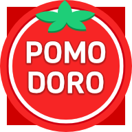

  <a href="#about">About</a> &bull;
  <a href="https://adrian-miasik.github.io/unity-pomodoro-docs/">Documentation</a> &bull;
  <a href="#downloads">Downloads</a> &bull;
  <a href="#media">Screenshots</a> &bull;
  <a href="#author-notes">Author Notes</a> &bull;
  <a href="#donate">Donate</a> &bull;
  <a href="/CONTRIBUTING.md">Contribute</a> &bull;
  <a href="#contact-us--support-line">Support</a> &bull;
  <a href="#contact-us--support-line">Contact</a>

  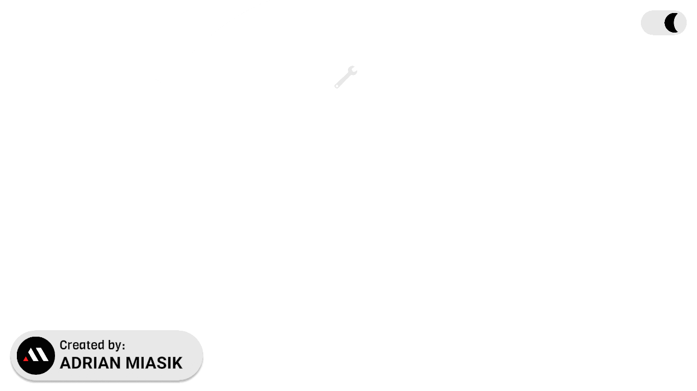

## About

Unity Pomodoro is an open source countdown timer app created in Unity designed primarily for desktop use. Unity Pomodoro is a time management tool based on the pomodoro technique, the aim is to improve your productivity by introducing timers for both your work and break sessions. Quickly swap between the two timers to keep you on track and focused.

**Platforms**: Windows, Mac, & Linux. (Android in Beta! APK located in the releases page)

**Version**:  2.2.0

**Author**:  **[`Adrian Miasik`](https://adrian-miasik.com)**

**License**: [GPL-3.0](LICENSE)

**Contributor(s)**: `-`  
Want to help? If you're interested in contributing to the project, please see our <a href="/CONTRIBUTING.md">contribution</a> document.

&nbsp;
## Downloads
### [Latest Release - v2.2.0](https://github.com/adrian-miasik/unity-pomodoro/releases/tag/v2.2.0)
#### Direct
- Windows
  - [64-bit](https://github.com/adrian-miasik/unity-pomodoro/releases/download/v2.2.0/unity-pomodoro-2.2.0-windows-desktop-64-bit.zip)
  - [32-bit](https://github.com/adrian-miasik/unity-pomodoro/releases/download/v2.2.0/unity-pomodoro-2.2.0-windows-desktop-32-bit.zip)
- Mac
  - [Universal](https://github.com/adrian-miasik/unity-pomodoro/releases/download/v2.2.0/unity-pomodoro-2.2.0-mac-desktop-universal.zip)
- Linux
  - [64-bit](https://github.com/adrian-miasik/unity-pomodoro/releases/download/v2.2.0/unity-pomodoro-2.2.0-linux-desktop-64-bit.zip)
- Android
  - [APK](https://github.com/adrian-miasik/unity-pomodoro/releases/download/v2.2.0/unity-pomodoro-2.2.0-android.apk) 
#### Platform Specific
- Steam 
  - [Coming Soon...](https://store.steampowered.com/app/2173940/Unity_Pomodoro/)
- [Google Play Store (Android)](https://play.google.com/store/apps/details?id=com.adrianmiasik.unitypomodoro)
  - The Android version provides **Mobile Notifications** when the timer is complete.
- [Microsoft Store (Universal Windows Platform)](https://www.microsoft.com/en-us/p/unity-pomodoro/9nbzqpmx9x7n)
  - The UWP version provides **Windows Notifications** when the timer is complete.
  - The UWP version provides **Windows Launcher** when a user interacts with a URL.
### Previous Releases
- [v2.1.1 (Hotfix) - Desktop Timer No Longer Decrements on App Focus Loss & Regain](https://github.com/adrian-miasik/unity-pomodoro/releases/tag/v2.1.1)
- [v2.1.0 - Android Support, Fixed Visual Artifacts, Improved Performance, and New Community Efforts](https://github.com/adrian-miasik/unity-pomodoro/releases/tag/v2.1.0)
- [v2.0.0 - Persistent Settings, Translucent Image Blur, Unity Analytics, Architecture, and Bugfixes!](https://github.com/adrian-miasik/unity-pomodoro/releases/tag/v2.0.0)
- [v1.9.0 - Release Media Generator & 'Set Pomodoro Count' Settings Option](https://github.com/adrian-miasik/unity-pomodoro/releases/tag/v1.9.0)
- [v1.8.0 - End Timestamp, Skip Button, Sidebar Improvements, Toggle Long Breaks, and More!](https://github.com/adrian-miasik/unity-pomodoro/tree/v1.8.0)
- [v1.7.1 - Long Breaks, Documentation, and Bugfixes](https://github.com/adrian-miasik/unity-pomodoro/tree/v1.7.1)
- [v1.6.0 - Confirmation Dialogs & 'Mute Audio When Out Of Focus' Settings Option](https://github.com/adrian-miasik/unity-pomodoro/releases/tag/v1.6.0)
- [v1.5.0 - Settings Panel & Sidebar Animation](https://github.com/adrian-miasik/unity-pomodoro/releases/tag/v1.5.0)
- [v1.4.0 - Sidebar Navigation](https://github.com/adrian-miasik/unity-pomodoro/releases/tag/v1.4.0)
- [v1.3.0 - 🎃 Halloween Theme & Digit Format Support](https://github.com/adrian-miasik/unity-pomodoro/releases/tag/v1.3.0)
- [v1.2.1 - Dark Mode, Tick Animation, and Architectural Improvements](https://github.com/adrian-miasik/unity-pomodoro/releases/tag/v1.2.1)
- [v1.1.0 - UWP, Keyboard Support, New Digit Animation](https://github.com/adrian-miasik/unity-pomodoro/releases/tag/v1.1.0)
- [v1.0.0 - Initial Launch](https://github.com/adrian-miasik/unity-pomodoro/releases/tag/v1.0.0)

&nbsp;
## Media
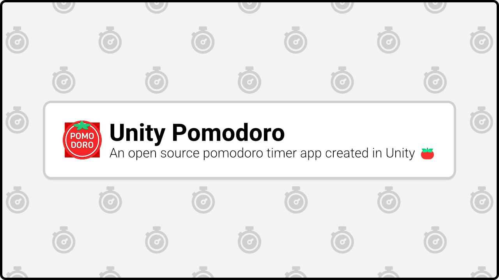

### Screenshots
#### Light

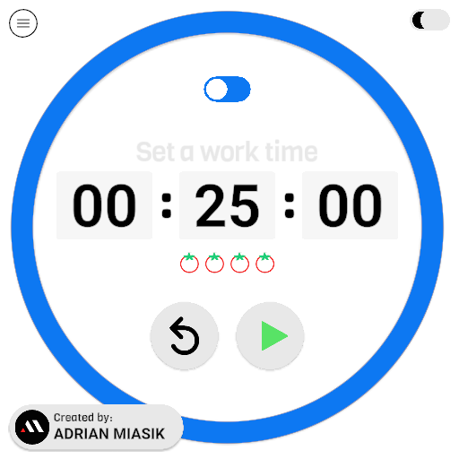
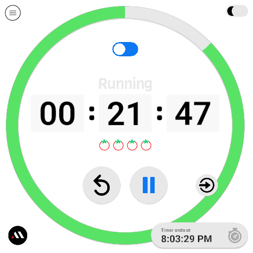
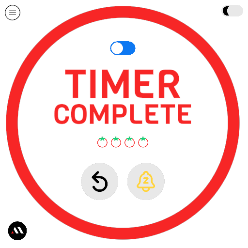
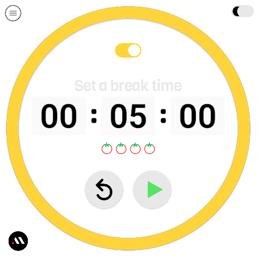
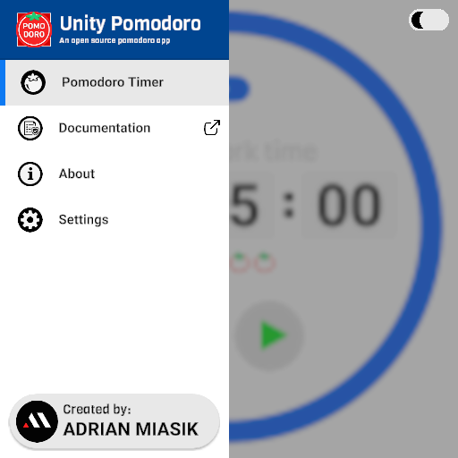
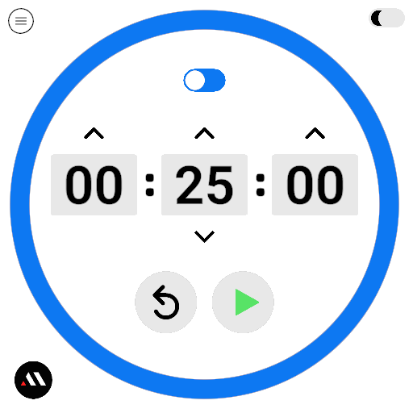
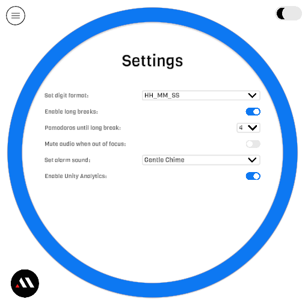

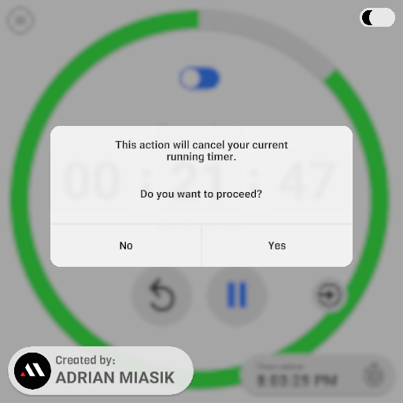

#### Dark

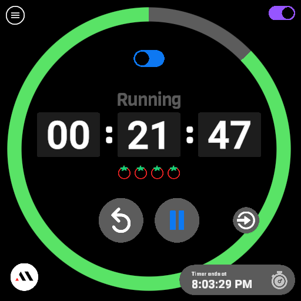
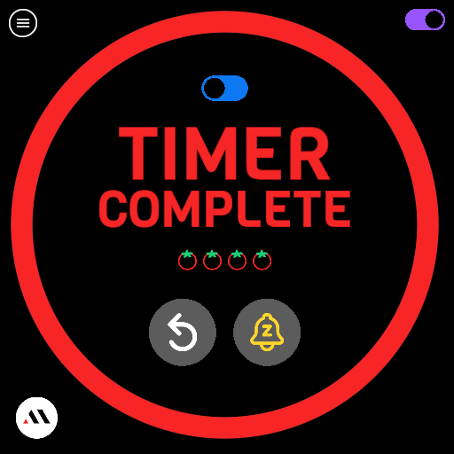
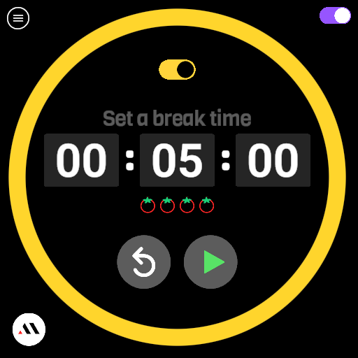
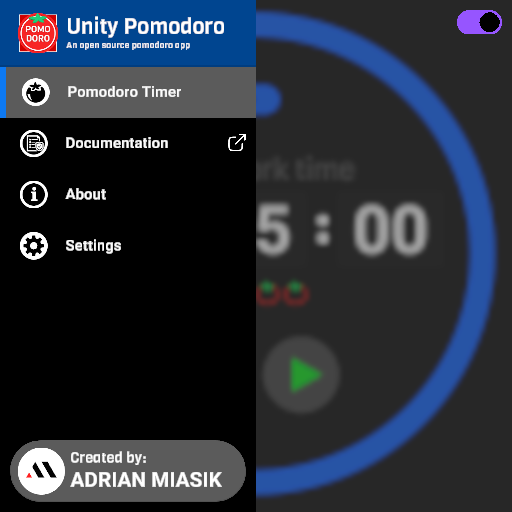
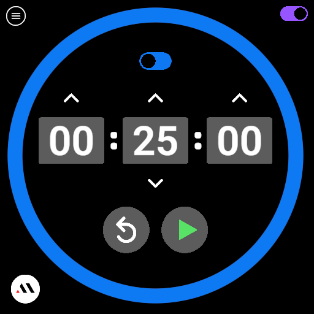
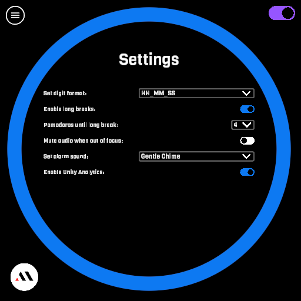
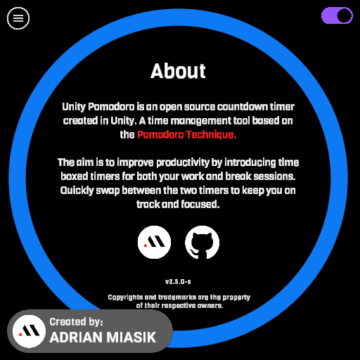
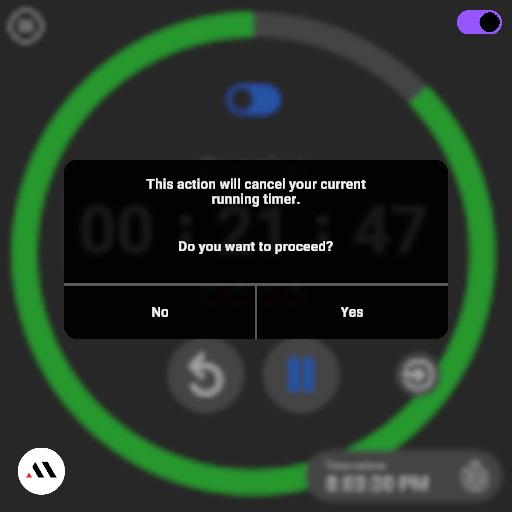

## Author Notes
- Unity Pomodoro is a pet project I've been developing in my spare time - A labour of love of sorts
- See [my GitHub profile](https://github.com/adrian-miasik) for more open source work
- I'm also currently open for work, if you're hiring send me an email at: `hire-me.76240@adrian-miasik.com`
- The svg assets have been created myself and/or sourced from The Noun Project
- Fun fact: This was the first time I tried to do my own foley / audio
- Special thanks to my microwave

## Donate
If you'd like to support my work, you can donate to help support this project via [GitHub Sponsors](https://github.com/sponsors/adrian-miasik) ❤️

## Contact Us / Support Line
Need help?  Found a bug?  
Send your questions, bug reports, and other support related inquiries to:  
`unity-pomodoro@adrian-miasik.com`
Alternatively, you can also report bugs directly to our [issues page](https://github.com/adrian-miasik/unity-pomodoro/issues)

For personal business related inquires / proposals:  
`business-line-76240@adrian-miasik.com`

## Legal
This project is not sponsored by, authorized by, or affiliated with Unity Technologies or its affiliates.

Copyrights and trademarks are the property of their respective owners.
- Adrian Miasik Logo
- Github Logo
