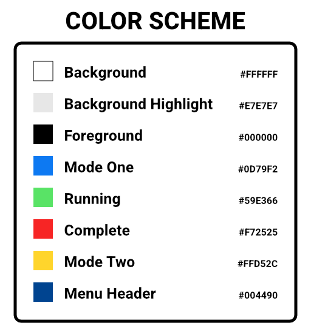
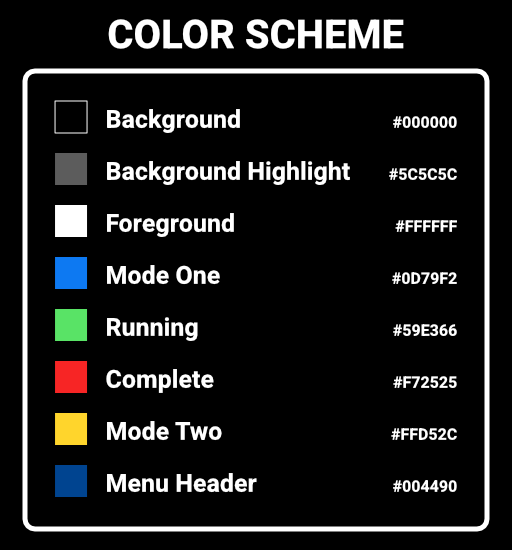

<h1 align="center">Unity Pomodoro</h1>

  

  <a href="#about">About</a> &bull;
  <a href="https://github.com/adrian-miasik/unity-pomodoro/wiki/Components-Documentation">Documentation</a> &bull;
  <a href="#downloads">Downloads</a> &bull;
  <a href="#media">Screenshots</a> &bull;
  <a href="#author-notes">Author Notes</a> &bull;
  <a href="https://github.com/adrian-miasik/unity-pomodoro/wiki">Wiki</a> &bull;
  <a href="#contribute">Contribute</a> &bull;
  <a href="#contact--support">Support</a> &bull;
  <a href="#contact--support">Contact Us</a>

  

## About

Unity Pomodoro is an open source countdown timer app created in Unity designed primarily for desktop use. Unity Pomodoro is a time management tool based on the pomodoro technique, the aim is to improve your productivity by introducing timers for both your work and break sessions. Quickly swap between the two timers to keep you on track and focused.

**Version**:  1.3.0

**Author**:  **[`Adrian Miasik`](https://adrian-miasik.com)**

**License**: [GPL-3.0](LICENSE)

**Contributor(s)**: `-`  
Want to help? If you're interested in contributing to the project, please see the <a href="#contribute">contribute</a> section.

&nbsp;
## Downloads
### [Latest Release - v1.3.0](https://github.com/adrian-miasik/unity-pomodoro/releases/tag/v1.3.0)
#### Direct
- Windows
  - [64-bit](https://github.com/adrian-miasik/unity-pomodoro/releases/download/v1.3.0/unity-pomodoro-1.3.0-windows-desktop-64-bit.zip)
  - [32-bit](https://github.com/adrian-miasik/unity-pomodoro/releases/download/v1.3.0/unity-pomodoro-1.3.0-windows-desktop-32-bit.zip)
- Mac
  - [Universal](https://github.com/adrian-miasik/unity-pomodoro/releases/download/v1.3.0/unity-pomodoro-1.3.0-mac-desktop-universal.zip)
- Linux
  - [64-bit](https://github.com/adrian-miasik/unity-pomodoro/releases/download/v1.3.0/unity-pomodoro-1.3.0-linux-desktop-64-bit.zip)
#### Platform Specific
- [Microsoft Store (Universal Windows Platform)](https://www.microsoft.com/en-us/p/unity-pomodoro/9nbzqpmx9x7n)
  - The UWP version provides **Windows Notifications** when the timer is complete.
  - The UWP version provides **Windows Launcher** when a user interacts with a URL.
### Previous Releases
- [v1.2.1 - Dark Mode, Tick Animation, and Architectural Improvements](https://github.com/adrian-miasik/unity-pomodoro/releases/tag/v1.2.1)
- [v1.1.0 - UWP, Keyboard Support, New Digit Animation](https://github.com/adrian-miasik/unity-pomodoro/releases/tag/v1.1.0)
- [v1.0.0 - Initial Launch](https://github.com/adrian-miasik/unity-pomodoro/releases/tag/v1.0.0)

&nbsp;
## Media

### Screenshots & Mocks
#### Light

#### Dark

## Author Notes
- Unity Pomodoro is a pet project I've been developing in my spare time
- See [my GitHub profile](https://github.com/adrian-miasik) for more open source work
- I'm also currently open for work, if you're hiring send me an email at: `hire-me.76240@adrian-miasik.com`
- The svg assets have been created myself and/or sourced from The Noun Project
- Fun fact: This was the first time I tried to do my own foley / audio
- Special thanks to my microwave

## Contribute
Interested in contributing?  
Send me an email `unity-pomodoro@adrian-miasik.com` & poke me to make a contributing doc.  
We will also modify the credits bubble to include contributors if people start contributing.

## Contact / Support
Need help?  Found a bug?  
Send your questions, bug reports, and other support related inquiries to:  
`unity-pomodoro@adrian-miasik.com`

For personal business related inquires / proposals:  
`hire-me.76240@adrian-miasik.com` 

## Legal
Copyrights and trademarks are the property of their respective owners.
- Adrian Miasik Logo
- Github Logo
