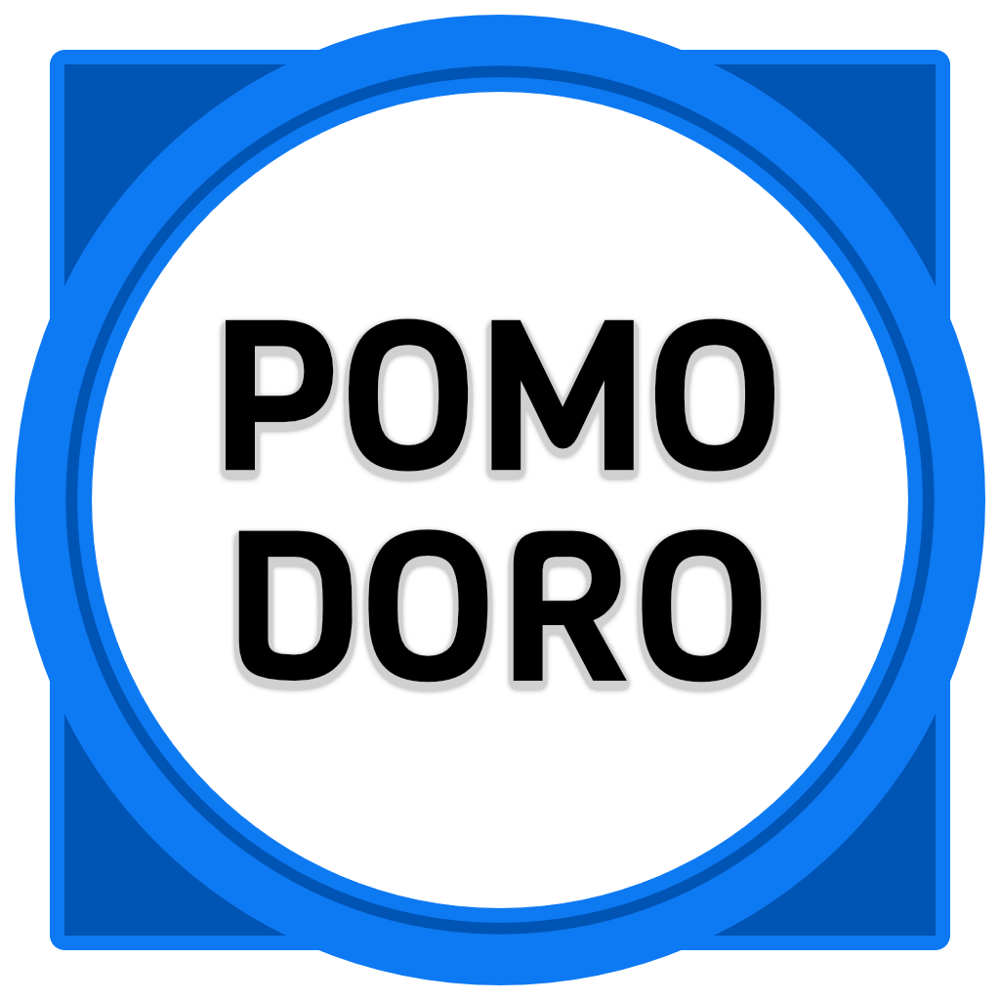
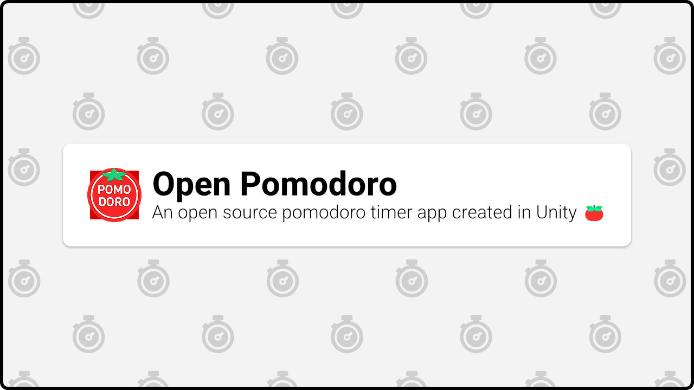
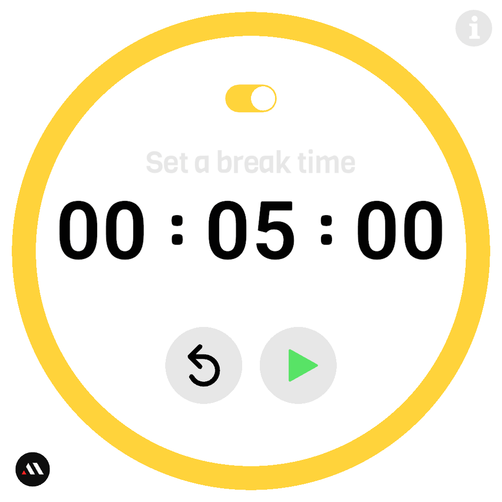
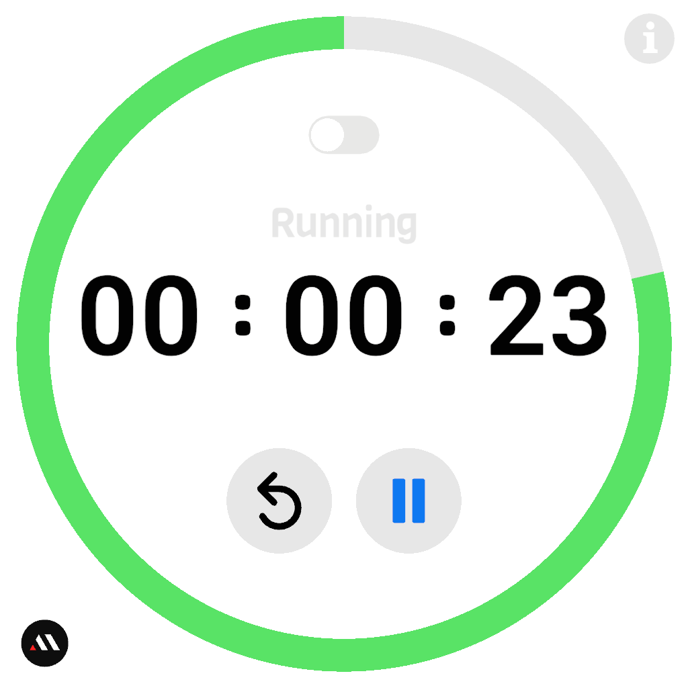
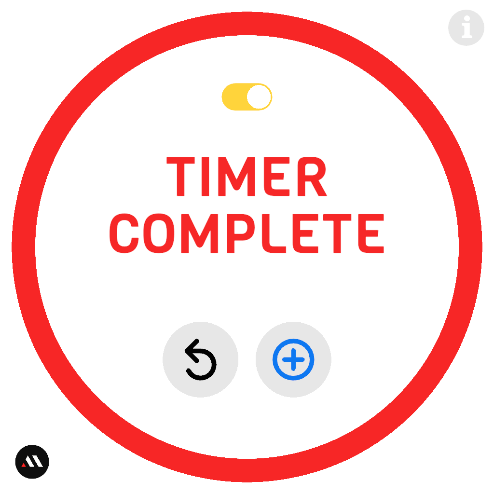
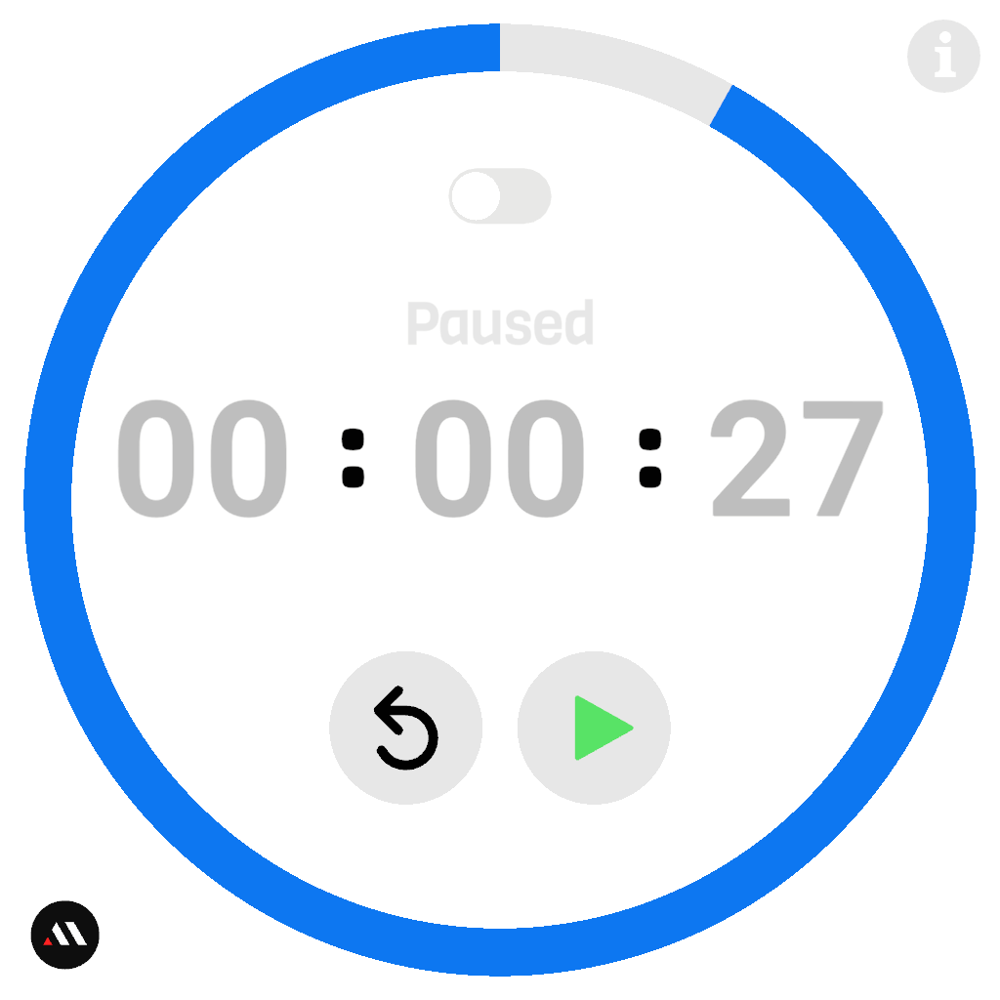
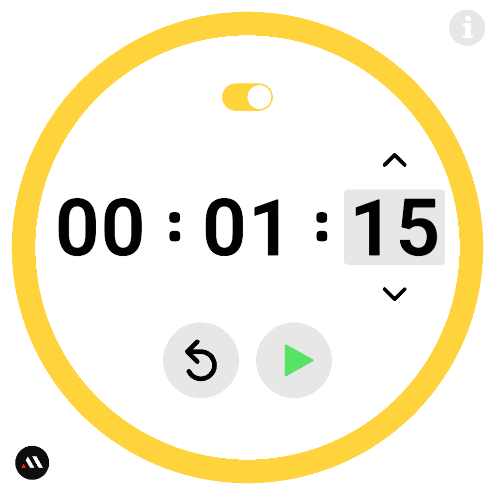
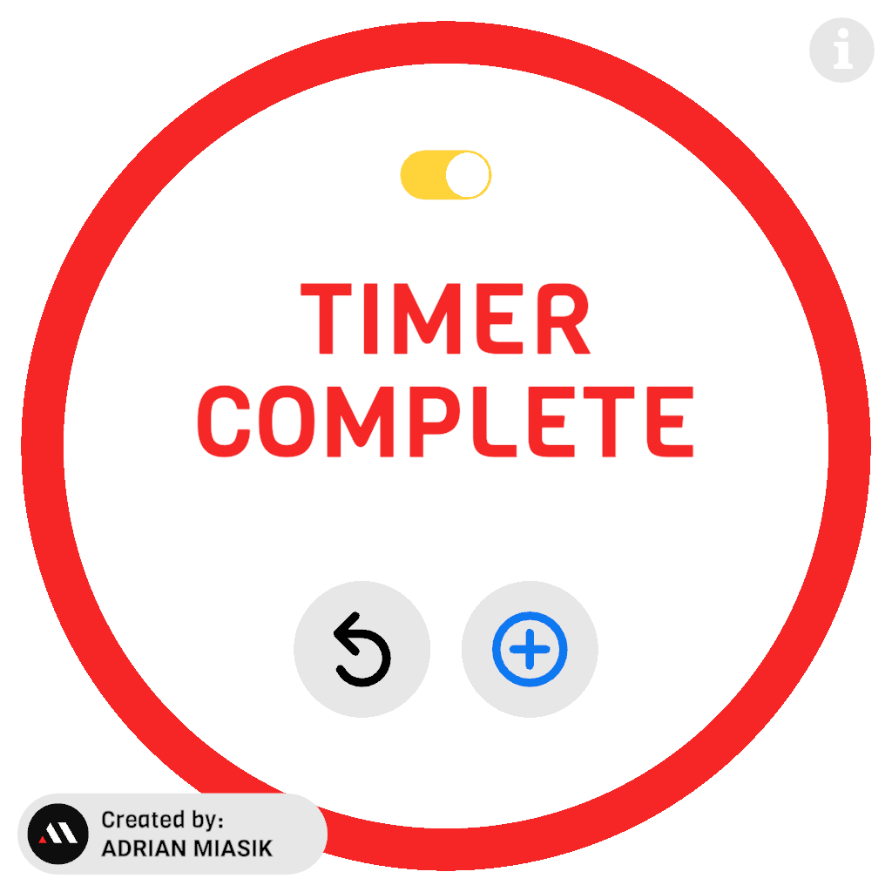

<h1 align="center">Unity Pomodoro</h1>

  

  <a href="#about">About</a> &bull;
  <a href="https://github.com/adrian-miasik/unity-pomodoro/wiki/Components-Documentation">Documentation</a> &bull;
  <a href="#downloads">Downloads</a> &bull;
  <a href="#media">Screenshots</a> &bull;
  <a href="#author-notes">Author Notes</a> &bull;
  <a href="https://github.com/adrian-miasik/unity-pomodoro/wiki">Wiki</a> &bull;
  <a href="#contribute">Contribute</a> &bull;
  <a href="#contact--support">Support</a> &bull;
  <a href="#contact--support">Contact Us</a>

## About

Unity Pomodoro is an open source countdown timer app created in Unity designed primarily for desktop use. Unity Pomodoro is a time management tool based on the pomodoro technique, the aim is to improve your productivity by introducing timers for both your work ***and break sessions***. Quickly swap between the two timers to keep you on track and focused.

**Version**:  1.0.0

**Author**:  **[`Adrian Miasik`](https://AdrianMiasik.com)**

**License**: [GPL-3.0](LICENSE)

**Contributor(s)**: `-`  
Want to help? If you're interested in contributing to the project, please see the <a href="#contribute">contribute</a> section.

&nbsp;
## Downloads

### Latest Release
- Windows (64-bit) - Coming soon
- Windows (32-bit) - Coming soon
- [Mac](https://github.com/adrian-miasik/unity-pomodoro/releases/download/v1.0.0/unity-pomodoro-1.0.0-mac-desktop-universal.zip)
- [Linux (64-bit)](https://github.com/adrian-miasik/unity-pomodoro/releases/download/v1.0.0/unity-pomodoro-1.0.0-linux-desktop-64-bit.zip)

&nbsp;
## Media

### Screenshots

## Author Notes
- Unity Pomodoro is a pet project I've been developing in my spare time
- See [my GitHub profile](https://github.com/adrian-miasik) for more open source work
- I'm also currently open for work, if you're hiring send me an email at: `hire-me.76240@adrian-miasik.com`
- The svg assets have been created myself and/or sourced from The Noun Project
- Fun fact: This was the first time I tried to do my own foley / audio
- Special thanks to my microwave

## Contribute
Interested in contributing?  
Send me an email & poke me to make a contributing doc.  
We will also modify the credits bubble to include contributors if people start contributing.

## Contact / Support
Need help?  Found a bug?  
Send your questions, bug reports, and other support related inquiries to:  
`unity-pomodoro@adrian-miasik.com`

For personal business related inquires / proposals:  
`hire-me.76240@adrian-miasik.com` 

## Legal
Copyrights and trademarks are the property of their respective owners.
- Adrian Miasik Logo
- Github Logo
